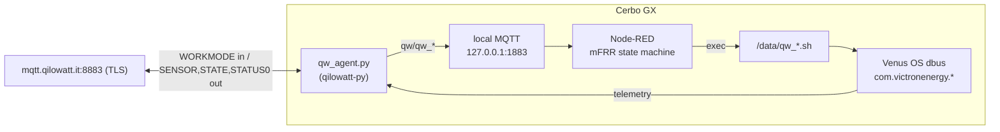

# Architecture

## Goal

Run Qilowatt mFRR participation entirely on a Victron Cerbo GX, with no Home
Assistant in the loop. The Cerbo must own both directions of the Qilowatt cloud
link:

- **Inbound** — receive `WORKMODE` dispatch commands (the mFRR signal).
- **Outbound** — report telemetry so the aggregator sees the device online and can
  verify delivery.

## Components

### qw_agent.py

Uses the official [`qilowatt-py`](https://github.com/qilowatt/qilowatt-py)
`QilowattMQTTClient` + `InverterDevice`:

- subscribes to `Q/{device_id}/cmnd/backlog`, parses `WORKMODE <json>` into a
  `WorkModeCommand`, and republishes the decoded fields to the local broker;
- publishes telemetry on the library's schedule: `Q/{device_id}/SENSOR` (~10 s),
  `STATE` (~60 s), `STATUS0` (startup + hourly);
- mirrors the cloud connection state to `qw/qw_connected` and a retained
  `qw/online` Last-Will.

### Local signal mapping

| WorkModeCommand | Local topic        | Used by state machine for |
|-----------------|--------------------|---------------------------|
| `_source`       | `qw/qw_source`     | IDLE↔ACTIVE trigger (`fusebox`/`kratt`) |
| `Mode`          | `qw/qw_mode`       | setpoint sign (`frrup` = export) |
| `PowerLimit`    | `qw/qw_powerlimit` | setpoint magnitude (W) |
| connection      | `qw/qw_connected`  | `mqtt_lost` failsafe |

### Node-RED state machine

`IDLE → ACTIVE` on an mFRR source: DESS off, then (after 2 s) write the signed
setpoint. `ACTIVE → ACTIVE` on power change: rewrite setpoint. `ACTIVE → IDLE` when
the source clears: setpoint 0 + DESS on. Failsafes: connection lost > 5 min, or
event > 30 min → release. It also maintains a `global.qw_mfrr` flag for a
co-resident curtailment flow (see [`../nodered/curtailment-mfrr-aware.md`](../nodered/curtailment-mfrr-aware.md)).

### Actuators

`/data/qw_*.sh` use the Venus `dbus` CLI to toggle DESS Mode and write
`AcPowerSetPoint`, with an absolute setpoint clamp and a standalone watchdog.

## Why a Python daemon + Node-RED (not one or the other)

- The Qilowatt protocol (TLS, `WORKMODE` parsing, mandatory `SENSOR`/`STATE`/`STATUS0`
  telemetry schema) is best handled by the vendor library — reimplementing it in
  Node-RED would mean tracking upstream changes by hand.
- The decision logic and actuation are naturally a Node-RED job, and Node-RED is
  typically already present for other site automation (load control, curtailment).

## Telemetry source

`dbus_telemetry.py` reads `com.victronenergy.*` and packs `EnergyData` /
`MetricsData`. The exact field set Qilowatt expects should be validated against the
live `SENSOR` payload for the target system — see the `VALIDATE` comments in that
file.
