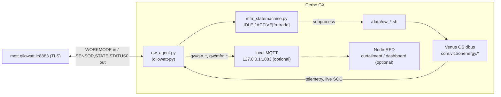

# Architecture

## Goal

Run Qilowatt mFRR participation entirely on a Victron Cerbo GX, with no Home
Assistant in the loop. The Cerbo must own both directions of the Qilowatt cloud
link:

- **Inbound** — receive `WORKMODE` dispatch commands (the mFRR signal, and the
  vendor's SOC-preparation trades).
- **Outbound** — report telemetry so the aggregator sees the device online and can
  verify delivery.

## Components

```mermaid
flowchart LR
    qwCloud["mqtt.qilowatt.it:8883 (TLS)"]
    subgraph cerbo [Cerbo GX]
        daemon["qw_agent.py<br/>(qilowatt-py)"]
        sm["mfrr_statemachine.py<br/>IDLE / ACTIVE[frr|trade]"]
        dbus["Venus OS dbus<br/>com.victronenergy.*"]
        sh["/data/qw_*.sh"]
        localmq["local MQTT<br/>127.0.0.1:1883 (optional)"]
        nr["Node-RED<br/>curtailment / dashboard (optional)"]
    end
    qwCloud <-->|"WORKMODE in / SENSOR,STATE,STATUS0 out"| daemon
    dbus -->|"telemetry, live SOC"| daemon
    daemon --> sm
    sm -->|"subprocess"| sh
    sh --> dbus
    daemon -.->|"qw/qw_*, qw/mfrr_*"| localmq
    localmq -.-> nr
```

Both live sites (site A, site B) run this path. Node-RED is not part of the
control loop; it is an optional consumer of the local bridge.

### qw_agent.py

Uses the official [`qilowatt-py`](https://github.com/qilowatt/qilowatt-py)
`QilowattMQTTClient` + `InverterDevice`:

- subscribes to `Q/{device_id}/cmnd/backlog`, parses `WORKMODE <json>` into a
  `WorkModeCommand`, logs it (`WORKMODE received: {...}`; `tools/afrr_capture.sh`
  tails that into the durable `/data/afrr-workmode.log`) and hands it to the
  state machine;
- publishes telemetry on the library's schedule: `Q/{device_id}/SENSOR` (~10 s),
  `STATE` (~60 s), `STATUS0` (startup + hourly), read from dbus through a
  per-site profile (`dc_coupled` / `ac_coupled`);
- runs the periodic `tick()` (failsafes, trade SOC target) and the
  `ConnectionWatchdog` (restart on a dead or deaf session);
- with `QW_LOCAL_BRIDGE=1`, republishes the decoded command and the event
  state to a local broker for Node-RED / dashboards.

### mfrr_statemachine.py

One `ACTIVE` state with two event *kinds*; both use the same actuator sequence
(DESS off → settle 2 s → signed `AcPowerSetPoint` → on end: setpoint 0 → DESS on).

| Kind    | Opens on                                                           | Setpoint sign            | SOC floor                    |
|---------|--------------------------------------------------------------------|--------------------------|------------------------------|
| `frr`   | `_source ∈ QW_MFRR_SOURCES`, `Mode ∈ {frrup, frrdown}`, `PowerLimit ≠ 0` | `frrup` −, `frrdown` +   | lowered to `QW_MFRR_MIN_SOC` |
| `trade` | `_source ∈ QW_TRADE_SOURCES`, `Mode ∈ QW_TRADE_MODES ⊆ {buy, sell}`, `PowerLimit ≠ 0` | `buy` +, `sell` −        | untouched (`off --no-floor`) |

Gates, in order:

1. **Source gate** — strangers never reach the actuators.
2. **Mode gate** — a trusted source speaks several dialects (`qilowatt` sends
   `frrup`/`frrdown` *and* `buy`). Only the two FRR modes and the configured
   trade modes are actuated; `savebattery`/`limitexport`/`normal`/… from any
   source are dropped and end a running event.
3. **Power gate** — a zero-power event Mode is the dispatcher's stand-down and
   ends the event instead of being held as a 0 W dispatch.
4. **Magnitude cap** — `|PowerLimit|` is capped to `QW_MAX_IMPORT_W` /
   `QW_MAX_EXPORT_W` before the script sees it (the script's clamp *rejects*
   and would leave the previous value in place).

Transitions:

- `IDLE → ACTIVE[kind]` on an event command.
- `ACTIVE[k] → ACTIVE[k]` on a power change: rewrite the setpoint only.
- `ACTIVE[frr] ↔ ACTIVE[trade]`: switch kind in place — setpoint rewritten, the
  duration clock restarted, **no DESS on/off cycle** in between. Switching to
  `frr` re-runs `qw_dess_toggle.sh off` (idempotent on the saved Mode) so the
  SOC floor is lowered for the dispatch.
- `ACTIVE → IDLE` on: non-event command, zero-power event Mode, QW link lost
  `> QW_MQTT_LOST_FAILSAFE_S`, event `> QW_MAX_EVENT_S` (frr) or
  `> QW_MAX_TRADE_S` (trade), a trade's live SOC (`com.victronenergy.system
  /Dc/Battery/Soc`) reaching the command's `BatterySoc` (buy: `≥`, sell: `≤`),
  or agent shutdown. A SOC read failure never ends a trade (fail-open toward
  continuing; the caps cover it).

Every START/END line names the kind and the trigger:
`mFRR END (kratt/frrup 0 W)`, `TRADE END (trade target reached: SOC 100% >= 100%)`,
`TRADE END (failsafe: event > 5400s)`.

### Actuators

`/data/qw_*.sh` use the Venus `dbus` CLI to toggle DESS Mode and write
`AcPowerSetPoint`, with an absolute setpoint clamp and a standalone watchdog:

- `qw_dess_toggle.sh off [--no-floor] | on | status` — atomic save/restore of
  DESS Mode and (without `--no-floor`) the shared ESS minimum-SOC floor.
- `qw_grid_setpoint.sh <signed W>` — asymmetric clamp, writes the setpoint.
- `qw_dess_watchdog.sh` — cron/boot-loop backstop that forces DESS back on after
  `QW_MAX_OFF_SECS` (must stay *above* both agent caps).
- `qw_log_audit.sh` — hourly log review: crashes, failsafes, dropped commands,
  foreign event ends, trade counts, command silence.

### Local signal mapping (optional bridge)

| Published            | Local topic          | Meaning                                              |
|----------------------|----------------------|------------------------------------------------------|
| `_source`            | `qw/qw_source`       | `fusebox` / `kratt` / `qilowatt` / `notimer` / …     |
| `Mode`               | `qw/qw_mode`         | `frrup` / `frrdown` / `buy` / `sell` / `normal` / …  |
| `PowerLimit`         | `qw/qw_powerlimit`   | requested magnitude (W)                              |
| connection           | `qw/qw_connected`    | `on` / `off`                                         |
| event state          | `qw/mfrr_active`     | `on` while ACTIVE (either kind) — curtailment stands down |
| event kind           | `qw/mfrr_kind`       | `frr` / `trade` / `none`                             |
| signed setpoint      | `qw/mfrr_signed_w`   | negative = export, positive = import                 |
| degraded             | `qw/mfrr_degraded`   | `true` while the last actuator write did not read back |
| liveness             | `qw/online`          | retained `true` / `false` (LWT)                      |

`mfrr_active` is `on` for trades as well: a `sell` is an export exactly like
`frrup`, and holding PV at 100 % during a `buy` costs nothing. A flow that wants
to behave differently per kind reads `mfrr_kind`. Topic names and payloads are
a contract pinned by `tests/test_local_bridge_contract.py`.

The same state is mirrored to `QW_STATE_FILE` (`/data/qw-agent/state.json`) for
consumers without a broker.

### Node-RED (optional, read-only consumer)

A Node-RED flow on the same Cerbo should only *read* the bridge topics — the
PV-curtailment stand-down in
[`../nodered/curtailment-mfrr-aware.md`](../nodered/curtailment-mfrr-aware.md)
is the reference. The original Node-RED orchestrator lives in
[`../contrib/nodered-legacy/`](../contrib/nodered-legacy/README.md) and must
**not** run alongside the agent — two writers on the same dbus paths race.

### Start-up, read-back and degraded state

- **Start-up recovery** (`agent/startup.py`): a process that died mid-event
  (crash, `kill -9`, reboot) leaves `qw_dess_toggle.sh`'s saved-Mode file on
  `/data` and DESS off; the watchdog cannot see a reboot because its stamp is
  on `/tmp`. Before connecting, the agent checks those files against the live
  DESS Mode and, if they show an unfinished event, writes setpoint 0 and DESS
  on (`STARTUP RECOVERY` in the log); a stale saved Mode with DESS on is
  removed. The
  post-connect WORKMODE snapshot reopens the event if it is still running.
- **Config sanity** (`CONFIG WARN`): event caps vs the watchdog cap, missing or
  example-default import/export caps, `QW_MFRR_MIN_SOC` vs the live floor,
  trades disabled.
- **Read-back**: `ScriptActuator` reads AcPowerSetPoint (`get`) and DESS Mode
  (`status`) back after every write and returns a bool. The state machine
  retries a failed write once; a second failure logs `actuation failed`, sets
  `degraded=True` (bridge `qw/mfrr_degraded`, `state.json`) and keeps tracking
  the event so the end command, the cap and the watchdog can still clean up.
- **Telemetry guard**: no SENSOR is published while dbus or `/Dc/Battery/Soc`
  is unreadable (`telemetry unavailable`, once a minute). An all-zero payload
  would tell the optimiser the battery is empty.

## Why a Python daemon (and why the vendor library)

- The Qilowatt protocol (TLS, `WORKMODE` parsing, the mandatory
  `SENSOR`/`STATE`/`STATUS0` telemetry schema) is best handled by the vendor
  library — reimplementing it would mean tracking upstream changes by hand.
- The decision logic is small, must be deterministic and testable (see
  `tests/`), and needs failsafes that keep running when the broker is quiet —
  a supervised Python process on a standard Venus OS image does that with no
  Venus OS Large / Node-RED dependency.

## Telemetry source

`agent/telemetry/base.py` reads `com.victronenergy.*` and packs `EnergyData` /
`MetricsData`; `dc_coupled.py` / `ac_coupled.py` supply the PV-power source.
The exact field set Qilowatt expects should be validated against the live
`SENSOR` payload for the target system — see the `VALIDATE` comments there.

## Diagnostics

`tools/afrr_probe.py --log /data/afrr-workmode.log` classifies the captured
WORKMODE stream (FRR / Q trade / unknown), measures FRR cadence (the aFRR tell),
trade → FRR latency, and the command-silence distribution that bounds a safe
`QW_IDLE_REFRESH_S`. See [`AFRR_VERIFICATION.md`](AFRR_VERIFICATION.md).
